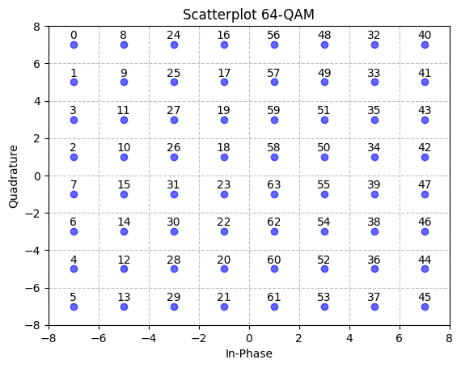
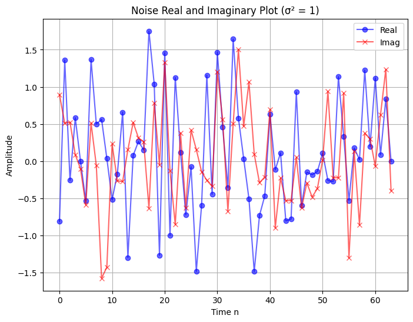
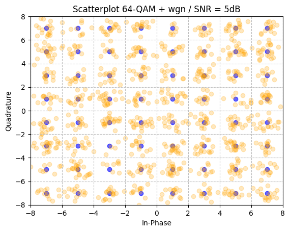
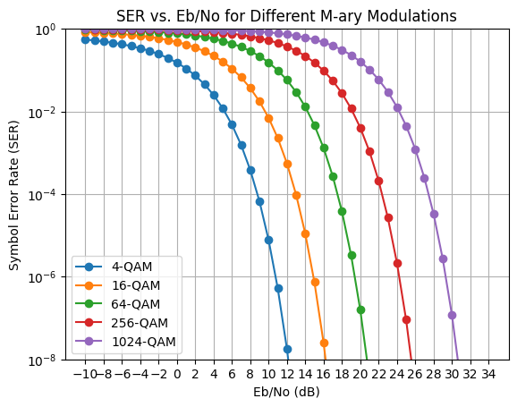
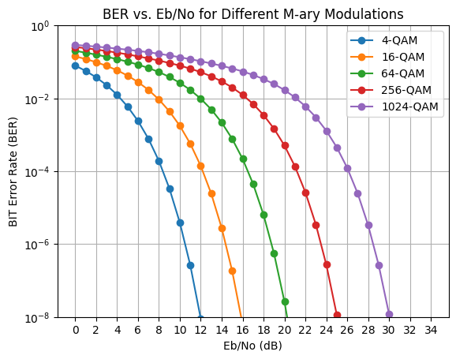

# Demonstração das Funções do PythonCommTools

Neste arquivo, apresentamos uma visão geral das principais funções disponíveis no PythonCommTools, juntamente com visualizações dos gráficos gerados.

## Função QAMMOD

A função `qammod()` é utilizada para modular sinais QAM (Quadrature Amplitude Modulation). Ela mapeia um conjunto de símbolos de entrada para um sinal modulado no domínio da amplitude e da fase.

## Função de Ruído (WGN)

A função `wgn()` gera ruído branco gaussiano aditivo. É frequentemente usada para simular o ruído em canais de comunicação.

## Teste do Canal com Ruído

Demonstração do comportamento de um canal de comunicação com adição de ruído.

## Funções BERAWGN e SERAWGN

As funções `berawgn()` e `serawgn()` são usadas para calcular a Taxa de Erro de Símbolo (SER) e a Taxa de Erro de Bit (BER) teóricas para diferentes modulações M-ária em presença de ruído.

## Cálculo do Erro de Símbolo

Esta seção demonstra uma implementação para calcular o Erro de Símbolo em relação à relação sinal-ruído (Eb/No) para diferentes modulações M-ária.

